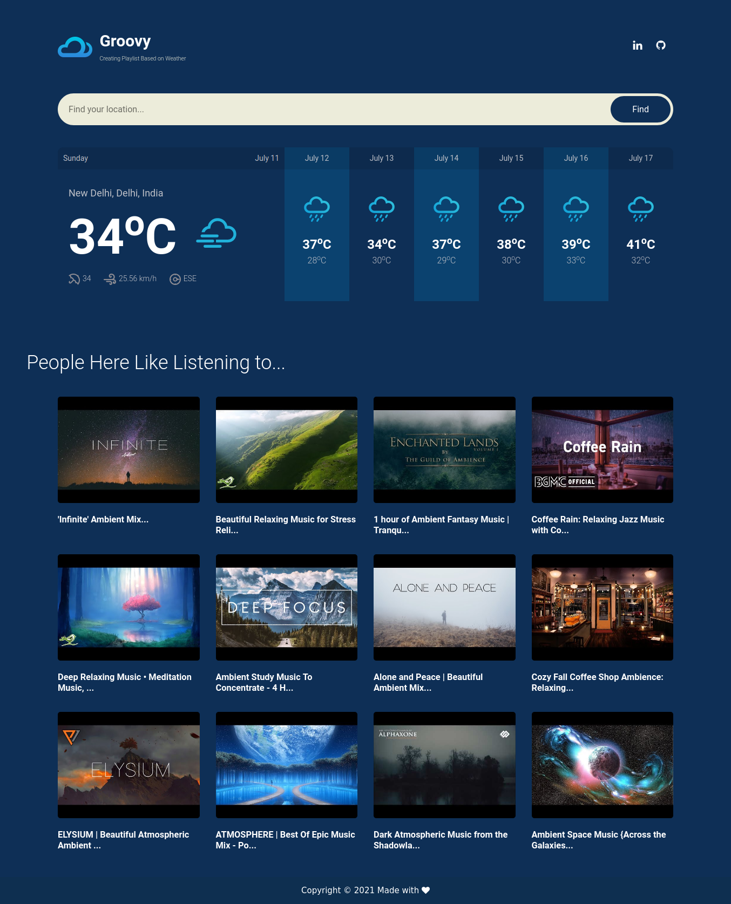

# [Groovy](https://groo-vy.herokuapp.com/)

This project is based on Climatune ,Brought to you by a partnership between AccuWeather and Spotify, Climatune aims to give us audiophiles an insight into how the weather affects what we listen to.

 Through a yearlong study comparing 85 billion anonymized streams on Spotify in over 900 cities nationwide, AccuWeather and Spotify analyzed the impact weather has on the music people listen to. Conclusions included:

• Sunny days typically encourage listening to happier and higher-energy music.

• Rainy days bring lower-energy, sadder-sounding music with more acoustic vs. electronic sounds.

• Snowy days encourage more instrumental music.

However, there are some variations in weather/listening behavior based on location. For example, in the U.S.:

• New York City and Philadelphia listeners are the most affected by bad weather; with residents of these cities substantially changing their listening when it rains.

• Chicagoans get excited by the rain and stream happier music.

# API Used
1. [Open Weather Map](https://openweathermap.org/): To get data of the Weather of place
2. [YouTube Data API](https://developers.google.com/youtube/v3): To get Music/Songs depending on the weather description

# Tech Stack:
 1. Geopy
 2. Flask
 3. Bootstrap
 4. HTML & CSS
 5. Jinja

 This whole Project is Deployed with help of <u> Heroku </u>

## Running the project

This project was created with [Flask](https://palletsprojects.com/p/flask/).

In the project directory, you can run:
(for python 3 and above)
#### `pip3 install -r requirements.txt`
which installs all the necessary dependencies.

#### `python3 run.py`
Run the app in the development mode. 
Open [http://localhost:5000](http://localhost:5000) to view it in the browser.

## Contributing

1. Fork it (<https://github.com/yourname/yourproject/fork>)
2. Create your feature branch (`git checkout -b feature/fooBar`)
3. Commit your changes (`git commit -am 'Add some fooBar'`)
4. Push to the branch (`git push origin feature/fooBar`)
5. Create a new Pull Request

<!-- Markdown link & img dfn's -->
[npm-image]: https://img.shields.io/npm/v/datadog-metrics.svg?style=flat-square
[npm-url]: https://npmjs.org/package/datadog-metrics
[npm-downloads]: https://img.shields.io/npm/dm/datadog-metrics.svg?style=flat-square
[travis-image]: https://img.shields.io/travis/dbader/node-datadog-metrics/master.svg?style=flat-square
[travis-url]: https://travis-ci.org/dbader/node-datadog-metrics
[wiki]: https://github.com/yourname/yourproject/wiki

